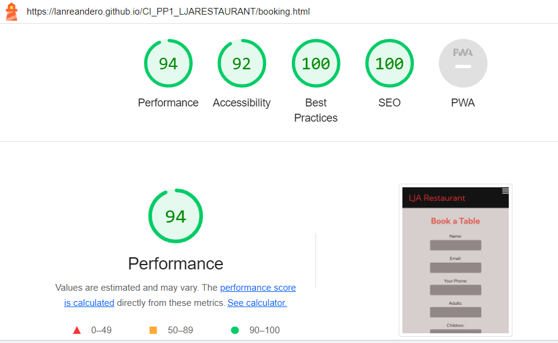

# LJA Restaurant

This project is a gateway to the vibrant flavors of Nigeria. The restaurant is located in Dundalk, Co. Louth, Ireland, and offers a warm and welcoming atmosphere to enjoy authentic Nigerian cuisine. This is designed to be a responsive website allowing visitors to view on a range of devices. It allows visitors to find out about the various menu we offer.

.

---

## CONTENTS

- [LJA Restaurant](#lja-restaurant)
  - [CONTENTS](#contents)
  - [User Experience (UX)](#user-experience-ux)
    - [User Stories](#user-stories)
  - [Design](#design)
    - [Typography](#typography)
    - [Imagery](#imagery)
  - [Features](#features)
    - [General Features on Each Page](#general-features-on-each-page)
    - [Future Implementations](#future-implementations)
    - [Accessibility](#accessibility)
  - [Technologies Used](#technologies-used)
    - [Languages Used](#languages-used)
    - [Frameworks, Libraries \& Programs Used](#frameworks-libraries--programs-used)
  - [Deployment](#deployment)
  - [Testing](#testing)
    - [W3C Validator](#w3c-validator)
    - [Lighthouse](#lighthouse)
  - [Credits](#credits)
    - [Code Used](#code-used)
    - [Content](#content)
    - [Media](#media)
  - [Acknowledgments](#acknowledgments)

---

## User Experience (UX)

Welcome to LJA Restaurant, where the vibrant flavors of Nigeria come alive! We have crafted a delightful User Experience (UX) to ensure you have a memorable and enjoyable time at our restaurant. From the moment you step in to the moment you leave, we aim to provide an authentic and immersive Nigerian dining experience.

1. Warm and Inviting Ambience:
As you enter LJA Restaurant, you'll be greeted by warm colors, traditional Nigerian decor, and soft Nigerian music playing in the background. The space is designed to transport you to the heart of Nigeria, making you feel at home and at ease.

2. Friendly and Knowledgeable Staff:
Our staff is dedicated to providing excellent service and hospitality. They will warmly welcome you, offer recommendations from the menu, and answer any questions you may have about Nigerian cuisine and our dishes.

3. Thoughtful Menu Design:
Our menu is thoughtfully designed to showcase a variety of authentic Nigerian dishes. Each item is accompanied by a brief description, including the key ingredients and regional significance. Vegetarian and vegan options are clearly marked, catering to different dietary preferences.

4. Culinary Delights:
The highlight of your experience at LJA Restaurant will undoubtedly be the mouthwatering dishes. Prepared by skilled chefs using fresh and high-quality ingredients, our meals will take you on a flavorful journey through Nigeria's diverse culinary landscape.

5. Interactive Dining Experience:
For a more interactive experience, we offer some dishes served in traditional Nigerian-style communal platters, allowing you to share and savor the flavors with your friends and family.

6. Attentive Service:
Throughout your meal, our attentive staff will be readily available to ensure your needs are met. Empty plates will be promptly cleared, and your beverages refilled.

7. Cultural Entertainment:
To immerse you in Nigerian culture, we occasionally feature live performances such as traditional music, dance, and storytelling. These events add an exciting and enriching element to your dining experience.

8. Comfortable Seating:
Our seating is designed for comfort, with cushioned chairs and ample space between tables to ensure privacy and a relaxed atmosphere.

9. Sanitary Practices:
We prioritize your health and safety. Our restaurant adheres to strict hygiene standards, and all common touchpoints are regularly sanitized.

10. Feedback and Suggestions:
We value your feedback and suggestions to continually improve our services. Comment cards or digital feedback channels will be available for you to share your thoughts, ensuring we meet and exceed your expectations.

At LJA Restaurant, we aim to provide a holistic User Experience that transcends just a meal. Our commitment is to transport you to the heart of Nigeria, introducing you to its rich culture and culinary heritage. We hope you leave with fond memories and a desire to return for another delightful journey through the flavors of Nigeria. Thank you for choosing LJA Restaurant; we look forward to serving you!

### User Stories

1. As a hungry customer, I want to view the menu of LJA Restaurant online, so I can easily browse through the available dishes and make an informed choice before visiting the restaurant.

2. As a customer with dietary restrictions, I want the LJA Restaurant's menu to indicate which dishes are vegetarian, vegan, gluten-free, or contain common allergens, so I can find suitable options that align with my dietary needs.

3. As a loyal customer, I want to join the LJA Restaurant's loyalty program, where I can earn points for every purchase and receive exclusive offers and discounts, encouraging me to visit the restaurant frequently.

4. As a customer planning a special event, I want to be able to reserve a table or book a private dining area at LJA Restaurant in advance, ensuring that I and my guests have a delightful experience during our celebration.

5. As a first-time visitor, I want the LJA Restaurant's website to provide information about the restaurant's history, ambiance, and customer reviews, so I can get a sense of what to expect and feel more comfortable choosing it for my dining experience.

6. As a customer who enjoys trying new dishes, I want the LJA Restaurant to feature seasonal or chef's special menus that change regularly, providing me with exciting culinary options each time I visit.

7. As a group of friends or colleagues, we want the LJA Restaurant to provide catering services for our events or parties, so we can enjoy authentic Nigerian cuisine at our chosen location.

8. As a customer who appreciates cultural experiences, I want the LJA Nigerian Restaurant to host occasional events, such as live music performances, traditional dance shows, or cultural festivals, enhancing my dining experience with a touch of Nigerian culture and entertainment.

## Design

### Typography

'Kumbh Sans' is a modern and versatile sans-serif font that brings a perfect balance between elegance and readability. Created with careful attention to detail, this font-family is the epitome of minimalistic sophistication. Whether used for headlines or body text, 'Kumbh Sans' effortlessly complements various design styles, making it a popular choice for both digital and print media.

Characteristics:
The 'Kumbh Sans' font-family boasts a clean and crisp design, characterized by its geometric shapes and smooth curves. It exudes a sense of confidence and professionalism while maintaining a friendly and approachable demeanor. With its sans-serif nature, 'Kumbh Sans' offers a contemporary appeal, making it suitable for projects that require a sleek and modern aesthetic.

Weights and Styles:
'Kumbh Sans' comes in a range of weights, from thin and light to bold and extra-bold, allowing designers to create visual hierarchy and add emphasis as needed. Additionally, it offers various styles, including regular, italic, and oblique, to accommodate diverse typographic needs.

Versatility:
One of the most outstanding features of 'Kumbh Sans' is its versatility. Whether you're designing a website, a poster, a magazine, or a logo, this font-family adapts effortlessly to any medium or layout. Its legibility remains intact even at smaller sizes, making it an excellent choice for body text.

Use Cases:

1. Headlines and Subheadings:
    The bold and eye-catching characteristics of 'Kumbh Sans' are ideal for headlines and subheadings, instantly grabbing the reader's attention and guiding them through the content.

2. Body Text:
    When used for body text, 'Kumbh Sans' provides an enjoyable reading experience with its balanced letterforms and generous spacing.

3. Branding:
    'Kumbh Sans' can lend a touch of professionalism and elegance to brand logos, giving them a timeless appeal.

4. User Interfaces (UI):
    Due to its legibility and contemporary style, 'Kumbh Sans' is an excellent choice for user interfaces, providing a seamless and engaging user experience.

5. Pairing:
    'Kumbh Sans' pairs exceptionally well with both serif and other sans-serif fonts. For a classic look, consider pairing it with a timeless serif font like 'Georgia' or 'Times New Roman.' To create a modern and harmonious combination, pair 'Kumbh Sans' with another sans-serif font such as 'Roboto' or 'Montserrat.'

In conclusion, the 'Kumbh Sans' font-family stands out as a versatile and elegant choice for a wide range of design projects. Its clean lines, balanced proportions, and extensive font weights make it a reliable companion for any typographic endeavor, infusing sophistication and clarity into your designs.

 is a popular choice for importing fonts to use in your project, as it doesn't require you to download the fonts to use them.

### Imagery

The images were used with the permission of their owners. All images were taken from the websites. I have credited these in the credits section.

I used this because it showed people enjoying the food and a good example of what the meal looked like.

## Features

### General Features on Each Page

1. Home Page:
    Attractive and responsive landing page design.
    Eye-catching hero section with high-quality images and a welcoming message.
    Featured dishes or special offers displayed to entice visitors.
    Quick access to other pages, such as the menu, contact, and reservation sections.
    Social media integration to showcase restaurant updates and engage with customers.
    Testimonials or customer reviews to build trust and credibility.

2. About Page:
    An engaging story about the restaurant's history, mission, and vision.
    Introduction to the chef and key staff members.
    Images or videos that provide a behind-the-scenes look at the restaurant's kitchen and atmosphere.
    Information about the restaurant's commitment to quality, sustainability, or community involvement.

3. Menu Gallery Page:
    Clear and visually appealing layout showcasing various menu items.
    High-resolution images of each dish along with descriptions and prices.

4. Contact Page:
    Contact form for general inquiries, feedback, or questions.
    Address, phone number, and business hours for easy access.
    Links to social media profiles and other contact channels.

5. Book Table Page:
    A user-friendly reservation form allowing customers to book a table.
    Option to choose date, time, party size, and any special requests.
    Real-time availability updates to prevent double bookings.
    Confirmation email sent to the customer after successful reservation.
    Contact details or hotline for customers who prefer to make reservations over the phone.

Additional Features:
  Responsive design that adapts to different devices, including mobile phones and tablets.
  Accessibility features to ensure the website is usable by people with disabilities.

### Future Implementations

1. Use javascript to perform return to top function on menu gallery page.
2. Correct javascript and listeners error on Navbar Menu Toggle.
3. Add price tag and shopping cart for online odering.
4. Competitions/giveaways page - This page would give further information/rules on
   the competitions and giveaways from the restaurant.

### Accessibility

I have been mindful during coding to ensure that the website is as accessible friendly as possible. I have achieved this by:

1. Using semantic HTML.
2. Using descriptive alt attributes on images on the site.
3. Providing information for screen readers where there are icons used and no text
   such as the review ratings for books & footer icons.
4. Ensuring that there is a sufficient colour contrast throughout the site.
5. Ensuring menus are accessible by marking the current page as current for screen
   readers.

## Technologies Used

### Languages Used

HTML and CSS were used to create this website.

JavaScript - was used for Navbar Menu Toggle functionality.

### Frameworks, Libraries & Programs Used

Balsamiq - Used to create wireframes.

Git - For version control.

Github - To save and store the files for the website.

Google Fonts - To import the fonts used on the website.

Font Awesome - For the iconography of social media links on the website.

Google Dev Tools - To troubleshoot and test features, solve issues with responsiveness and styling.

 To compress images.

 To resize images and change to webp format.

 To create favicon.

 To show the website image on a range of devices.

## Deployment

Github Pages was used to deploy the live website. The instructions to achieve this are below:

1. Log in (or sign up) to Github.
2. Find the repository for this project, CI_PP1_LJARESTAURANT.
3. Click on the Settings link.
4. Click on the Pages link in the left hand side navigation bar.
5. In the Source section, choose main from the drop down select branch menu. Select
   Root from the drop down select folder menu.
6. Click Save. Your live Github Pages site is now deployed at the URL shown.

## Testing

### W3C Validator

The W3C validator was used to validate the HTML on all pages of the website. It was also used to validate CSS in the style.css file. There were no error reported.

### Lighthouse

I used Lighthouse within the Chrome Developer Tools to allow me to test the performance, accessibility, best practices and SEO of the website. The results of all pages of the website in mobile and desktop mode are as below.

## Credits

### Code Used

 for his tutorials on Navbar Menu Toggle and codes including Javascript

Credit to Love Running Walkthrough Project in Code Institute Module for the great insight in getting this project through.

### Content

Content for the website was written by me.

### Media

I would like to give credit to [Google](https://www.google.com) and [Freepik](ttps://www.freepik.com) for the free images used throughout the website. The home page image of friends having fun, the dining and food display image on the about page to the all menu images displayed in the the gallery page.
  
## Acknowledgments

I would like to express my sincere gratitude to [Mo Shami and Daisy Mc Girr](Mentors at Code Institute) for their invaluable guidance and support throughout the development of this project. Their expertise, insightful feedback, and encouragement were instrumental in shaping the direction of this work. I am truly grateful for the time they dedicated to answering my questions and providing me with valuable insights. This project would not have been possible without their assistance.
